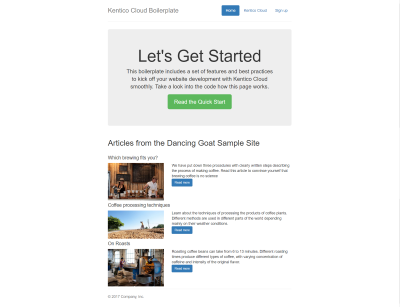

# Kontent.ai Boilerplate for ASP.NET Core MVC

|                                                            Package                                                            |                                                           Downloads                                                           |                        Compatibility                         |
| :---------------------------------------------------------------------------------------------------------------------------: | :---------------------------------------------------------------------------------------------------------------------------: | :----------------------------------------------------------: |
|  |  | [`net5.0`](https://dotnet.microsoft.com/download/dotnet/5.0) |

This boilerplate lets you easily scaffold a web project for development with Kontent.ai and give you a head start in a successful web project. It includes a set of pre-configured features and demonstrates best practices in order to kick off your website development with Kontent smoothly.

## What's included

- [Kontent.ai Delivery SDK](https://github.com/kontent-ai/delivery-sdk-net)
  - [Sample link resolver](#how-to-resolve-links)
- [Pre-build event for model generating](#how-to-generate-strongly-typed-models-for-content-types)
- [Webhook-enabed caching](#how-to-set-up-webhook-enabled-caching)
- [HTTP Status codes handling (404, 500, ...)](#how-to-handle-404-errors-or-any-other-error)
- [Adjustable images](#how-to-resize-images-based-on-window-width)
- [Sitemap.xml](#how-to-adjust-the-sitemapxml) generator
- [URL Rewriting examples](#how-to-adjust-url-rewriting)
  - 301 URL Rewriting
  - www -> non-www redirection
- Configs for Dev and Production environment
- robots.txt
- Logging
- Unit tests ([xUnit](https://xunit.net/))

## Getting started

### Installation from NuGet

1. Run `dotnet new --install "Kontent.Ai.Boilerplate::*"` to install the boilerplate to your machine
2. Run `dotnet new kontent-ai-mvc --name "MyWebsite" [-pid|project-id "<projectid>"] [-d|domain "<domain_name>"] [--output "<path>"]` to init a website from the template
   - You can change the project ID later at any time in `appsettings.json`
3. Open in the IDE of your choice and Run

_Note: You can [install the template from the sourcecode](../../wiki/Installation-from-source) too._

## How Tos

### How to generate Strongly Typed Models for Content Types

By convention, all [strongly-typed Content Type models](https://github.com/kontent-ai/delivery-sdk-net/blob/master/docs/customization-and-extensibility/strongly-typed-models.md) are generated and stored within the `Models/ContentTypes` folder. All generated classes are marked as [`partial`](https://msdn.microsoft.com/en-us/library/wa80x488.aspx) to enable further customization without losing the generated code.

The generating is facilitated by a [.NET generator tool](https://github.com/kontent-ai/model-generator-net) as pre-build event. If you wish to customize the process, adjust the [`Tools/GenerateModels.ps1`](https://github.com/kontent-ai/boilerplate-net/blob/master/src/content/Kontent.Ai.Boilerplate/Tools/GenerateModels.ps1) script.

For instance, to set a different namespace, set the `-n` command line parameter to `[project namespace].Models`. Or, to enable usage of [Display Templates (MVC)](http://www.growingwiththeweb.com/2012/12/aspnet-mvc-display-and-editor-templates.html) for rich-text elements, set `--structuredmodel true`.

You can regenerate the models using the included PowerShell script that utilizes the model generator utility. The script is located at .

### How to resolve links

Rich text elements in Kontent.ai can contain links to other content items. It's up to a developer to decide how the links should be represented on a live site. Resolution logic can be adjusted in the [`CustomContentLinkUrlResolver`](https://github.com/kontent-ai/boilerplate-net/blob/master/src/content/Kontent.Ai.Boilerplate/Resolvers/CustomContentLinkUrlResolver.cs). See the [documentation](https://github.com/kontent-ai/delivery-sdk-net/blob/master/docs/customization-and-extensibility/rich-text/resolving-item-links.md) for detailed info.

### How to set up webhook-enabled caching

All content retrieved from Kontent.ai is by default [cached](https://github.com/kontent-ai/delivery-sdk-net/blob/master/docs/retrieving-data/caching.md) for 24 minutes. When content is stale (a newer version exists) it is cached for only 2 seconds. You can change the expiration times via the `DeliveryCacheOptions` in [Startup](https://github.com/kontent-ai/boilerplate-net/blob/master/src/content/Kontent.Ai.Boilerplate/Startup.cs#L42-L47).

If you want to invalidate cache items as soon as they're updated in Kontent, you need to [create a webhook](https://kontent.ai/learn/tutorials/develop-apps/integrate/webhooks#a-create-a-webhook) and point it to the `/Webhooks/Webhooks` relative path of your application. The URL of the app needs to be publicly accessible, e.g. `https://myboilerplate.azurewebsites.net/Webhooks/Webhooks`. Finally, copy the API secret and store it as `WebhookOptions::Secret` in your `Configuration` object, typically in the [Secret Manager](https://docs.microsoft.com/en-us/aspnet/core/security/app-secrets) or [Azure Key Vault](https://docs.microsoft.com/en-us/aspnet/core/security/key-vault-configuration)

**Note**: During local development, you can use the [ngrok](https://ngrok.com/) service to route to your workstation. Simply start your application locally and run command `.\ngrok.exe http [port] -host-header="localhost:[port]"` (e.g. `.\ngrok.exe http 59652 -host-header="localhost:59652"`) and set the webhook URL to the displayed HTTPS address.

**Note**: Speed of the Delivery/Preview API service is already tuned up because the service uses a geo-distributed CDN network for most of the types of requests. Therefore, the main advantage of caching in Kontent.ai applications is not speed but lowering the amount of requests needed (See [pricing](https://kontent.ai/pricing) for details).

### How to render responsive images

The boilerplate contains a sample implementation of the `img-asset` tag helper from the [Kontent.Ai.AspNetCore](https://www.nuget.org/packages/Kontent.Ai.AspNetCore) NuGet package. Using the `img-asset` tag helper, you can easily create an `img` tag with `srcset` and `sizes` attributes.

### How to adjust the sitemap.xml

The boilerplate contains a sample implementation of the [`SiteMapController`](https://github.com/kontent-ai/boilerplate-net/blob/master/src/content/Kontent.Ai.Boilerplate/Controllers/SiteMapController.cs). Make sure you specify desired content types in the `Index()` action method. Also, you can adjust the URL resolution logic in the `GetPageUrl()` method.

### How to handle 404 errors or any other error

Error handling is setup by default. Any server exception or error response within 400-600 status code range is handled by ErrorController. By default, it's configured to display Not Found error page for 404 error and General Error for anything else.

### How to adjust URL rewriting

The Boilerplate is configured to load all [URL Rewriting](https://docs.microsoft.com/en-us/aspnet/core/fundamentals/url-rewriting) rules from [IISUrlRewrite.xml](/src/content/Kontent.Ai.Boilerplate/IISUrlRewrite.xml) file. Add or modify existing rules to match your expected behavior.
This is a good way to set up 301 Permanent redirects or www<->non-www redirects.

You can adjust the domain name in the default rewriting rules during the template instantiation by applying the `-d|domain` parameter.

## Get involved

Check out the [contributing](CONTRIBUTING.md) page to see the best places to file issues, start discussions, and begin contributing.
